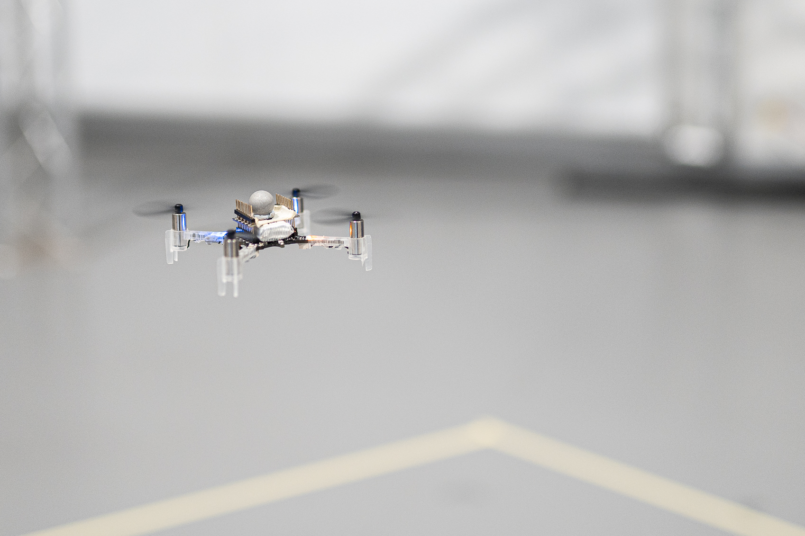
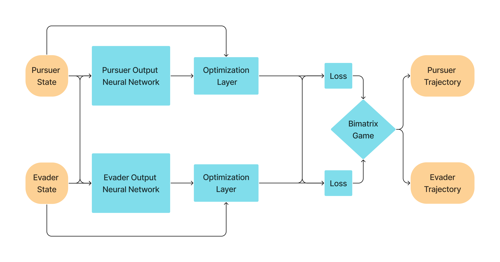
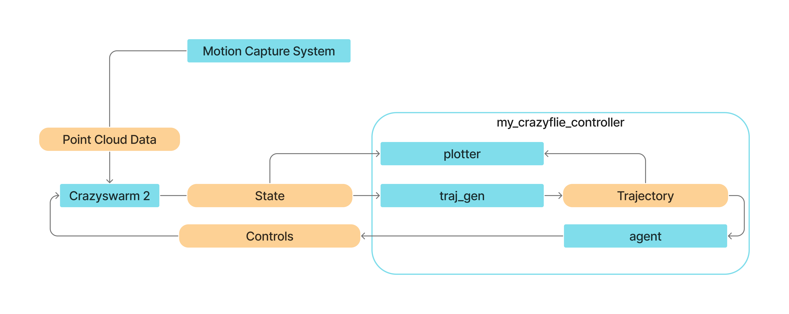

# Real Time Pursuit-Evasion Trajectory Generation for Drones using Deep Declarative Networks




## Description


This repository implements a learning-based mixed-strategy pursuit-evasion trajectory generation and demonstrates its feasibility using a physical micro-drone testbed, specifically the Crazyflie 2.1, utilizing the CrazySwarm 2 ROS package.

## Introduction

Aerial pursuit-evasion games pose significant challenges with applications ranging from anti-drone military operations to civilian missions like search and rescue. In these scenarios, agents must consider their adversary's potential strategies when determining their actions.

Traditionally, obtaining the optimal trajectories in real-time has not been feasible due to the mathematical complexity, even if highly approximated. However, the recent development in deep declarative networks provides a potential way to compute high-quality pursuit-evasion trajectories in real-time.

## Requirements

### For Both Physical and Simulation Tests:

- Python 3.x
- PyTorch
- NumPy
- CvXpy

### For Physical Tests Only:

- ROS2
- Crazyflie 2.1 drones (or compatible models)
- Crazyradio PA dongles (or compatible communication interface)
- Vicon motion capture system (or compatible system)

## Getting Started (Physical Testbed)

1. Clone this repository:

```
https://github.com/Avvienash/Mixed-Learning-Trajectory-Generation/upload/main
```

2. Install dependencies:
```
pip install -r requirements.txt
```


3. Set up hardware: Ensure your Crazyflie drones and Vicon motion capture system are configured correctly. Refer to their respective documentation for specific instructions.

4. Make sure ROS2 is installed and running.

5. Install the Crazyflie 2 ROS2 package if not already present: [CrazySwarm 2 Installation](https://imrclab.github.io/crazyswarm2/installation.html)

6. Build ROS2 nodes: Navigate to your ROS2 workspace and build the nodes:
```
cd <your_ros2_workspace>
colcon build --symlink-install

```

7. Run the physical test: In separate terminals:
- Launch Crazyflies
  ```
  ros2 launch crazyflie launch.py
  ```
- Run Trajectory generator
  ```
  ros2 run my_crazyflie_controller traj_gen
  ```
- Run Plotter
  ```
  ros2 run my_crazyflie_controller plotter
  ```
- Run Agents (Pursuer and Evader)
  ```
  ros2 run my_crazyflie_controller pursuer
  ros2 run my_crazyflie_controller evader
  ```

**Note:** Control drones manually or run recorded trajectories by using other ROS2 nodes from my_crazyflie_controller.

### my_crazyflie_controller Nodes:

- ```traj_gen```: Generates real-time trajectories for agents and publishes them.
- ```plotter```: Plots the position and trajectories of the agents in real-time.
- ```pursuer```: Sends commands to the pursuer Crazyflie based on the generated trajectory.
- ```evader```: Sends commands to the evader Crazyflie based on the generated trajectory.
- ```pursuer_sim```: Runs the pursuer in simulation and publishes the states.
- ```evader_sim```: Runs the evader in simulation and publishes the states.
- ```pursuer_marker```: Represents the pursuer as a MOCAP marker (User may move marker during the run).
- ```evader_marker```: Represents the evader as a MOCAP marker (User may move marker during the run).
- ```circler```: Flies the agent in a prerecorded circular path around the origin.
- ```figure8```: Flies the agent in a prerecorded figure 8 path around the origin (base test from Crazyswarm).
- ```land```: Returns agents to their starting position.

### Additional Notes

- Consider ethical and safety guidelines when operating drones in real-world environments. Refer to the risk assessment guidelines in media/documents/risk_assesnt.pdf.
- Adjust configuration files in config/ as needed for your specific environment.
- For simulation testing, refer to alternative instructions.

## Getting Started (Simulation Only)

1. Clone this repository:
```
git clone https://github.com/avvienash/pursuit-evasion-trajectory-gen.git
```

2. Install dependencies:
```
pip install -r requirements.txt
```

3. Run the test script:
```
python test_single_run.py
```

### Overview of Included Python Scripts

- ```main.py```: This script defines the model and handles the training process.
- ```test_single_run.py```: It runs scenarios of pursuer vs. evader with either specified initial conditions or random ones.
- ```test_random_states.py```: This script runs multiple tests with random initial states and plots the results.
- ```test_grid.py```: It runs tests for each possible initial condition in the xy grid.


## ALGORITHM ARCHITECTURE (TRAJECTORY GENERATOR)



The implementation of the trajectory generation is shown in the figure above and explained in the steps below. 

The trajectory generator starts by using the states of the pursuer and evader as input for a neural network. This network then produces a set of potential trajectories that are optimized to ensure feasibility. 

The loss is calculated for all combinations of pursuer and evader trajectories, creating a Bimatrix Game. This game is solved to find the equilibrium point. The trajectory corresponding to this equilibrium point is chosen as the optimal trajectory.

## PHYSICAL TESTBED

We managed to implement this method on a physical testbed using micro-drones as the agents and a motion capture system to obtain the states. The environment was set up as per the original publication, a 2D dimensional pentagon Plane with a single pursuer and evader. We ran multiple tests and compared it to the original simulated results. In conclusion, we have successfully replicated the proposed method and demonstrated the feasibility on a physical testbed.



## RESULTS AND DISCUSSION

The tests, conducted in a 2D pentagon environment with a single pursuer versus a single evader, yielded the following outcomes:

### Pursuer Drone vs Simulated Evader:

https://github.com/Avvienash/Mixed-Learning-Trajectory-Generation/assets/66234703/1a92fa78-b97b-402b-ae53-42364aa6fee9

### Simulated Pursuer vs Evader Drone:

https://github.com/Avvienash/Mixed-Learning-Trajectory-Generation/assets/66234703/851f1245-7a79-4434-9052-e806285007ea

### Pursuer Drone vs Drone Evader:

https://github.com/Avvienash/Mixed-Learning-Trajectory-Generation/assets/66234703/4f273f87-3007-43a5-8aac-4f654afb0c7c

## CONCLUSION AND FUTURE PLANS

In conclusion, this study successfully replicates and expands upon a method for learning mixed strategies in pursuit-evasion games with drone agents. Through the implementation using mini-drones, the proposed approach demonstrates its versatility and accuracy to the mathematical predictions.

Future plans include exploring different dynamic systems (e.g., Unicycle Dynamics, Bicycle Dynamics), exploring three-dimensional games, and multi-agent implementation and testing.


## REFERENCES

1. Chung, Timothy H., Geoffrey A. Hollinger, and Volkan Isler. "Search and pursuit-evasion in mobile robotics: A survey." Autonomous robots 31 (2011): 299-316.
2. Gould, Stephen, Richard Hartley, and Dylan Campbell. "Deep declarative networks." IEEE Transactions on Pattern Analysis and Machine Intelligence 44.8 (2021): 3988-4004.
3. Peters, L., Ferranti, L., Stachniss, C., & Laine, F. (2022). Learning Mixed Strategies in Trajectory Games. ArXiv. /abs/2205.00291

## Languages and Tools
<p align="left"> <a href="https://opencv.org/" target="_blank" rel="noreferrer">

  </a> <a href="https://pytorch.org/" target="_blank" rel="noreferrer"> 
  </a> 
 
 </p>


*Author: Avvienash Jaganathan*


